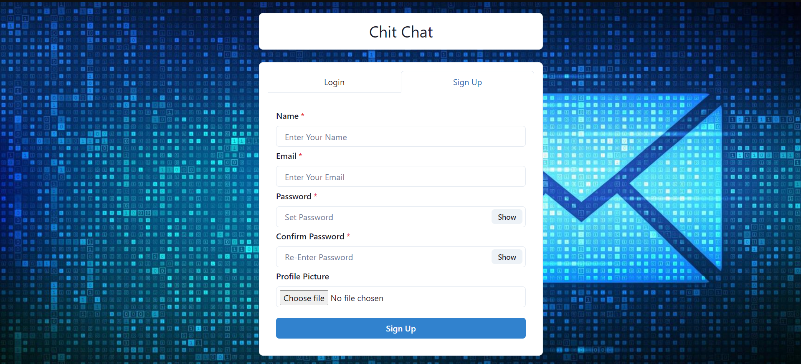
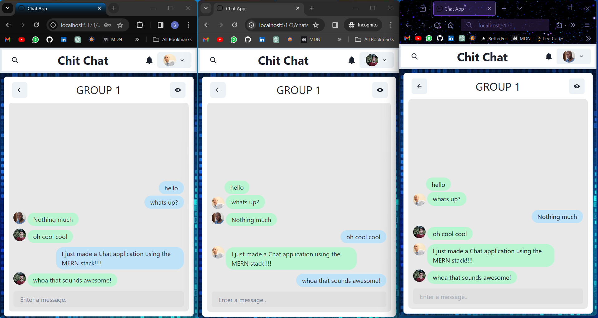

# ChatApp

## Overview

Chit Chat is a versatile and user-friendly real-time messaging application designed to facilitate seamless communication between individuals and groups. Whether you're looking to chat one-on-one or collaborate with multiple users in a group setting, Chit Chat has you covered.

## Preview

Furthur images present in ./project_images

## Key Features

- **Single Chat and Group Chat**: Engage in one-on-one conversations or create and participate in group discussions with multiple users.
- **Add and Remove Users**: Group chat administrators can easily add new users to the conversation and remove existing participants as needed.
- **Register and Login Functionality**: Users can register for an account with their email and password, and securely log in to access the chat application.
- **Password Hashing with bcrypt**: User passwords are securely hashed using bcrypt, ensuring protection against unauthorized access and safeguarding user data.
- **User Authentication with JWT**: Authentication is implemented using JSON Web Tokens (JWT), providing a secure and efficient method for verifying user identities and authorizing access to chat functionalities.
- **Instant Messaging**: Send and receive messages in real-time using socket.io, fostering seamless communication between users.
- **Real Time Notifications**: Stay informed and engaged with real-time notifications that keep you updated on new messages, mentions, and activities within the chat application.

## Contribute:

Found a bug or have an enhancement in mind?
Contribute to the project by opening issues and pull requests.
